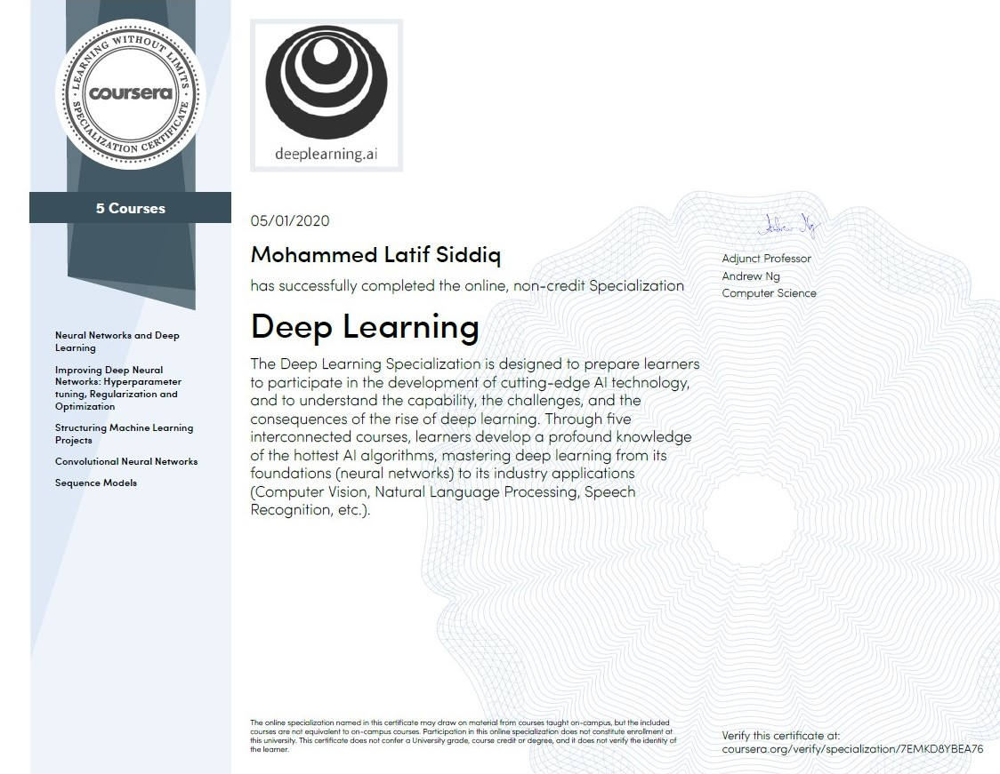

# Deep-learning-Specialization

If you want to break into AI, this Specialization will help you do so. Deep Learning is one of the most highly sought after skills in tech. We will help you become good at Deep Learning.

In five courses, you will learn the foundations of Deep Learning, understand how to build neural networks, and learn how to lead successful machine learning projects. You will learn about Convolutional networks, RNNs, LSTM, Adam, Dropout, BatchNorm, Xavier/He initialization, and more. You will work on case studies from healthcare, autonomous driving, sign language reading, music generation, and natural language processing. You will master not only the theory, but also see how it is applied in industry. You will practice all these ideas in Python and in TensorFlow, which we will teach.

## Neural Networks and Deep Learning

If you want to break into cutting-edge AI, this course will help you do so. Deep learning engineers are highly sought after, and mastering deep learning will give you numerous new career opportunities. Deep learning is also a new "superpower" that will let you build AI systems that just weren't possible a few years ago.

In this course, you will learn the foundations of deep learning. When you finish this class, you will:

- Understand the major technology trends driving Deep Learning
- Be able to build, train and apply fully connected deep neural networks
- Know how to implement efficient (vectorized) neural networks
- Understand the key parameters in a neural network's architecture

## Improving Deep Neural Networks: Hyperparameter tuning, Regularization and Optimization

This course will teach you the "magic" of getting deep learning to work well. Rather than the deep learning process being a black box, you will understand what drives performance, and be able to more systematically get good results. You will also learn TensorFlow.

After 3 weeks, you will:

- Understand industry best-practices for building deep learning applications.
- Be able to effectively use the common neural network "tricks", including initialization, L2 and dropout regularization, Batch normalization, gradient checking,
- Be able to implement and apply a variety of optimization algorithms, such as mini-batch gradient descent, Momentum, RMSprop and Adam, and check for their convergence.
- Understand new best-practices for the deep learning era of how to set up train/dev/test sets and analyze bias/variance
- Be able to implement a neural network in TensorFlow.

## Structuring Machine Learning Projects

You will learn how to build a successful machine learning project. If you aspire to be a technical leader in AI, and know how to set direction for your team's work, this course will show you how.

Much of this content has never been taught elsewhere, and is drawn from my experience building and shipping many deep learning products. This course also has two "flight simulators" that let you practice decision-making as a machine learning project leader. This provides "industry experience" that you might otherwise get only after years of ML work experience.

After 2 weeks, you will:

- Understand how to diagnose errors in a machine learning system, and
- Be able to prioritize the most promising directions for reducing error
- Understand complex ML settings, such as mismatched training/test sets, and comparing to and/or surpassing human-level performance
- Know how to apply end-to-end learning, transfer learning, and multi-task learning
  
## Convolutional Neural Networks

This course will teach you how to build convolutional neural networks and apply it to image data. Thanks to deep learning, computer vision is working far better than just two years ago, and this is enabling numerous exciting applications ranging from safe autonomous driving, to accurate face recognition, to automatic reading of radiology images.

You will:

- Understand how to build a convolutional neural network, including recent variations such as residual networks.
- Know how to apply convolutional networks to visual detection and recognition tasks.
- Know to use neural style transfer to generate art.
- Be able to apply these algorithms to a variety of image, video, and other 2D or 3D data.

## Sequence Models

This course will teach you how to build models for natural language, audio, and other sequence data. Thanks to deep learning, sequence algorithms are working far better than just two years ago, and this is enabling numerous exciting applications in speech recognition, music synthesis, chatbots, machine translation, natural language understanding, and many others.

You will:

- Understand how to build and train Recurrent Neural Networks (RNNs), and commonly-used variants such as GRUs and LSTMs.
- Be able to apply sequence models to natural language problems, including text synthesis.
- Be able to apply sequence models to audio applications, including speech recognition and music synthesis.

## Conclusion

I started the course on 20 April 2020 and finished it on 1 May 2020.

Here is the certificate:

